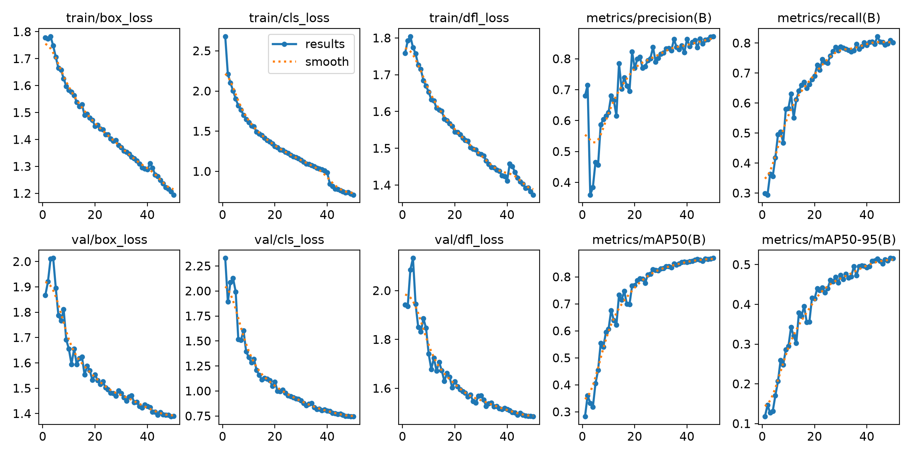
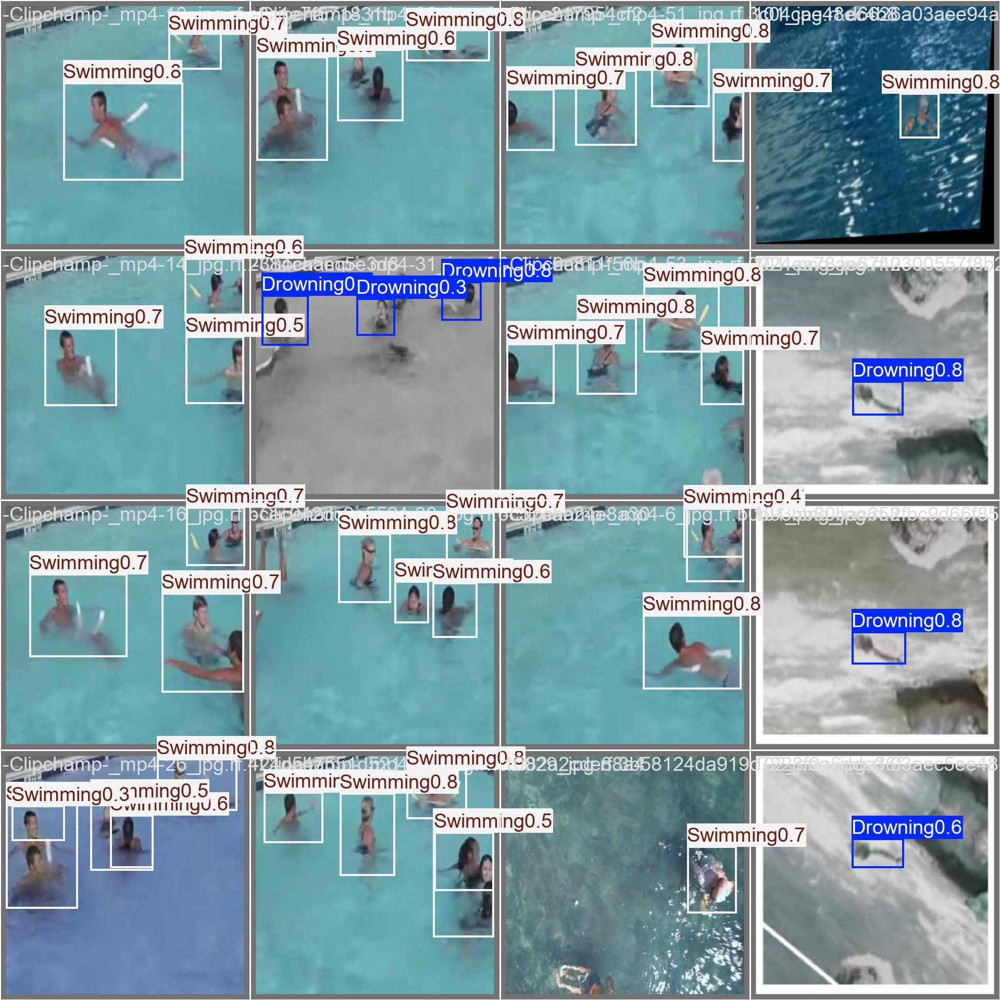
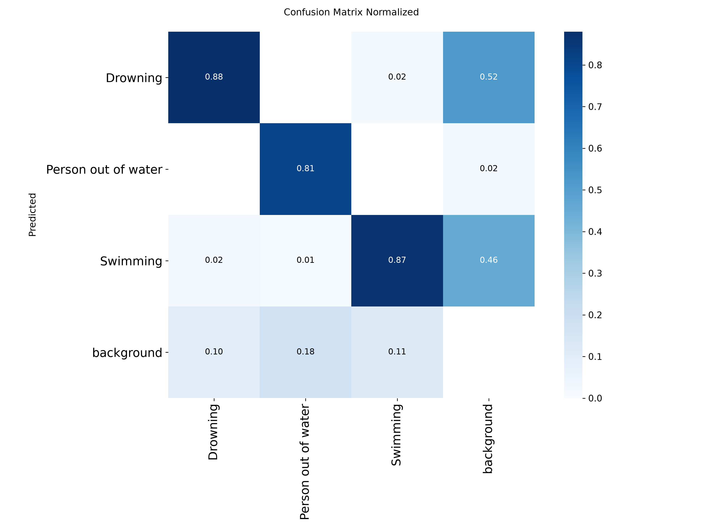

# Underwater Drowning Detection — YOLOv8 Model

A YOLOv8 object detection model trained to identify **drowning**, **swimming**, and **person out of water** behaviors from underwater and aerial footage — built as the computer-vision component of [SeaYou](https://github.com/ZAmystic/seayou), a drone-assisted drowning prevention platform developed at Belgium Campus iTversity.

> **My role:** SeaYou is a multi-person team project spanning drone hardware, a live dashboard, backend services, and drift modeling. This repo covers specifically **the detection model I trained** — data preparation, training, and evaluation. Full platform: [github.com/ZAmystic/seayou](https://github.com/ZAmystic/seayou)

## Demo

https://github.com/user-attachments/assets/90ca6c94-9e1d-4120-ae67-f8edb7b11038


*Model running on real pool CCTV footage, detecting swimmers in real time with confidence scores overlaid.*

## Problem

Drowning is a leading cause of unintentional injury death worldwide, and lifeguard visual monitoring has real limits — distance, glare, crowded pools, low light. This model is a step toward automated visual monitoring: flagging at-risk swimmers from camera or drone footage so a human can be alerted faster.

## Dataset

[Underwater Drowning Detection Dataset](https://doi.org/10.6084/m9.figshare.29497235) (figshare) — 5,613 manually annotated underwater images across three balanced classes, captured in controlled swimming pool environments with lifeguard supervision and participant consent:

| Class | Images |
|---|---|
| Swimming | 1,871 |
| Struggling | 1,871 |
| Drowning | 1,871 |

Pre-split 4,488 train / 1,125 validation, YOLO-format bounding box annotations, 640×640 RGB.

## Approach

- **Model:** YOLOv8n (Ultralytics)
- **Training:** 50 epochs, CPU (AMD Ryzen 5 5600X), ~24.4 hours
- **Classes used:** Drowning, Person out of water, Swimming

Training and validation loss decreased smoothly across all 50 epochs with no divergence, and precision/recall/mAP climbed steadily to a plateau — indicating stable convergence rather than overfitting or an unstable run.



## Results

| Class | Precision | Recall | mAP50 | mAP50-95 |
|---|---|---|---|---|
| **All** | 0.871 | 0.809 | 0.867 | 0.516 |
| Drowning | 0.876 | 0.809 | 0.906 | 0.550 |
| Person out of water | 0.923 | 0.807 | 0.859 | 0.551 |
| Swimming | 0.814 | 0.811 | 0.837 | 0.447 |

Inference: ~37.7ms/image (CPU).

### Sample predictions



*Detections across pool, ocean, and low-light conditions, with model confidence shown per box.*

### Confusion matrix



**Limitation, stated honestly:** the three real classes (Drowning, Swimming, Person out of water) are rarely confused *with each other* — the model reliably tells them apart when it detects a person at all. The main weak point is background confusion: Drowning and Swimming subjects are sometimes missed entirely (classified as background) at a meaningful rate, likely due to small/distant subjects and water surface distortion. This is a solvable problem — the results below are on it — but not something to hide.

## What's next

- I plan to build on this by contributing to model deployment/integration within the SeaYou pipeline
- Address the background-confusion limitation above — likely via targeted augmentation for distant/small subjects and threshold tuning
- Evaluate on real (non-pool) aerial/drone footage to test out-of-distribution performance

## Repo structure

```
drone-drowning-detection/
├── README.md
├── notebooks/        # training notebook
├── results/          # training curves, confusion matrix, sample predictions
├── demo/             # annotated demo clip
└── requirements.txt
```

## Reproducing this

1. Download the [dataset](https://doi.org/10.6084/m9.figshare.29497235) and place it under `datasets/` (matching the path used in the notebook)
2. Install requirements: `pip install -r requirements.txt`
3. Run `notebooks/training_notebook.ipynb`

## Requirements

```
ultralytics>=8.0
```

## Acknowledgements

Dataset: Alzaabi, H., Alzaabi, S., Kohail, S. — *Underwater Drowning Detection Dataset*, figshare (2025). https://doi.org/10.6084/m9.figshare.29497235
